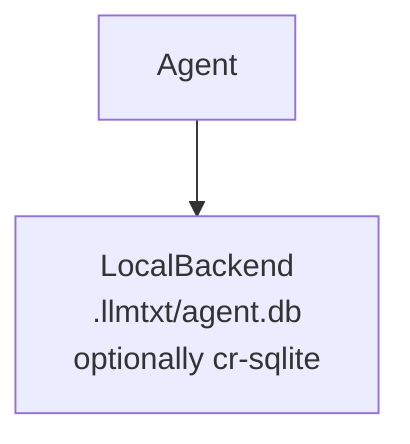
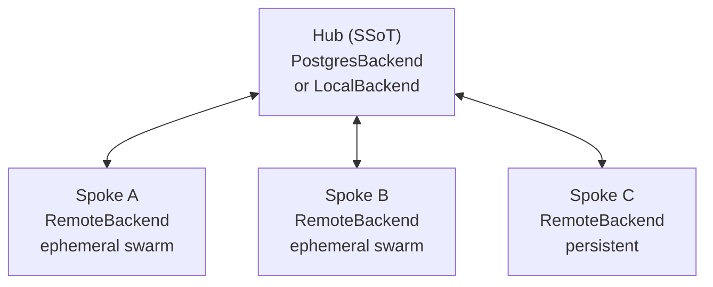
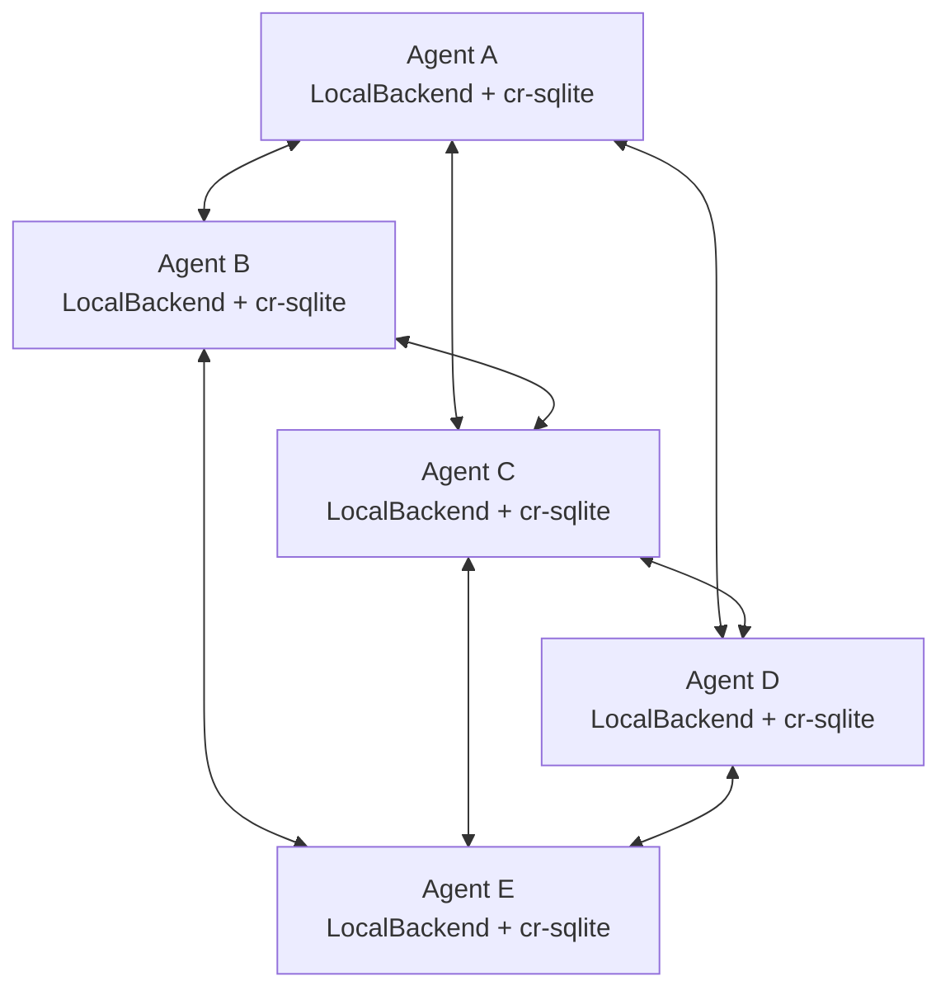

# Deployment Topologies

LLMtxt supports three topology modes that control how agents connect, where state is stored, and how convergence is achieved. Choose the topology that matches your collaboration requirements; all three use the same `Backend` interface.

## Quick Reference

| Topology | Agents | Network | Convergence | Best for |
|----------|--------|---------|-------------|---------|
| `standalone` | 1 | None | N/A | Local dev, single agent |
| `hub-spoke` | 1 hub + N spokes | Hub-centric | Hub is SSoT | Swarms, CI, production |
| `mesh` | 2–10 persistent | Peer-to-peer | CRDT + cr-sqlite | Offline-first teams |

## Standalone

One agent, one local `.db` file, zero network dependency.



**Use when**:
- Single developer or single agent
- No collaboration required
- Offline-first local testing
- No network available

**Config example**:

```typescript
import { createBackend } from 'llmtxt';

// Basic standalone
const backend = createBackend({
  topology: 'standalone',
  storagePath: '.llmtxt', // defaults to .llmtxt
});

// Standalone with cr-sqlite (enables sync later via llmtxt sync)
const backendWithSync = createBackend({
  topology: 'standalone',
  storagePath: './my-agent',
  crsqlite: true,
  // Optional: override extension path for air-gapped environments
  // crsqliteExtPath: '/usr/local/lib/crsqlite.so',
});
```

**Routing**:

| Operation | Route |
|-----------|-------|
| All reads | LocalBackend |
| All writes | LocalBackend |
| Convergence | Not required (single writer) |

## Hub-and-Spoke

One hub is the Single Source of Truth. Spokes are `RemoteBackend` clients that read from and write to the hub. Ephemeral swarm workers are spokes with no local `.db` file.



Spokes come in two flavors:

- **Ephemeral (swarm workers)**: `RemoteBackend` only, no local `.db`. Connect, write, disconnect. Hub holds all state.
- **Persistent with hub sync**: `LocalBackend` (cr-sqlite) + `RemoteBackend` pointing at hub. Local replica for offline reads; hub is still the SSoT.

**Use when**:
- 100+ ephemeral agent swarms
- CI pipelines with shared state
- Shared production deployment
- Centralized audit trail required
- Any scenario where a central SSoT is preferred

**Config examples**:

```typescript
// Ephemeral swarm worker — no local .db, all state lives on hub
const ephemeralWorker = createBackend({
  topology: 'hub-spoke',
  hubUrl: 'https://api.llmtxt.my',
  apiKey: process.env.LLMTXT_API_KEY,
  // persistLocally: false (default)
});

// Persistent spoke — local replica + hub sync
const persistentSpoke = createBackend({
  topology: 'hub-spoke',
  hubUrl: 'https://api.llmtxt.my',
  apiKey: process.env.LLMTXT_API_KEY,
  persistLocally: true,
  storagePath: './persistent-agent',
  // Or use Ed25519 identity instead of API key
  // identityPath: './identity.json',
});

// Self-hosted hub (LocalBackend acting as hub)
const selfHostedHub = createBackend({
  topology: 'hub-spoke',
  hubUrl: 'http://localhost:3000',
  apiKey: 'local-dev-key',
});
```

**Routing** — ephemeral spokes:

| Operation | Route |
|-----------|-------|
| All reads | RemoteBackend → hub |
| All writes | RemoteBackend → hub |
| Convergence | Hub owns all merges |

**Routing** — persistent spokes (`persistLocally: true`):

| Operation | Route |
|-----------|-------|
| Read (documents, versions) | LocalBackend (replica, stale ok) |
| Write (createDocument, publishVersion) | RemoteBackend → hub (authoritative) |
| CRDT applyCrdtUpdate | Hub (authoritative) + propagated to local on next sync |
| subscribeSection / subscribeStream | LocalBackend (in-process, low latency) |
| Lease acquire/renew/release | RemoteBackend → hub (distributed lock requires SSoT) |
| A2A / Scratchpad | RemoteBackend → hub |

## Mesh

N persistent peers, each with their own cr-sqlite `LocalBackend`. No central hub required. Peers sync directly with each other via the P2P transport.



**Use when**:
- Offline-first peer-to-peer collaboration
- Air-gapped environments
- Small persistent agent teams (2–10 peers)
- No central coordinator acceptable

**Config example**:

```typescript
// Mesh agent with static peer list
const meshAgent = createBackend({
  topology: 'mesh',
  storagePath: './alice-data',
  identityPath: './alice-identity.json', // Ed25519 keypair
  peers: [
    'unix:/tmp/llmtxt-bob.sock',
    'unix:/tmp/llmtxt-carol.sock',
  ],
  transport: 'unix', // 'unix' or 'http'
  // meshDir: '/tmp/llmtxt-mesh', // peer advertisement directory
});

// Mesh agent using HTTP transport (cross-machine)
const meshHttp = createBackend({
  topology: 'mesh',
  storagePath: './remote-agent',
  transport: 'http',
  port: 7642,
  peers: ['http://192.168.1.100:7642'],
});
```

**Routing**:

| Operation | Route |
|-----------|-------|
| All reads | LocalBackend (local) |
| All writes | LocalBackend (local) |
| Lease acquire | LocalBackend (local clock; best-effort LWW) |
| Convergence | Background P2P sync (cr-sqlite changesets) |
| CRDT merge | Application-level Loro merge on applyChanges |

**Note on leases in mesh**: `section_leases` use LWW merge (last writer wins). Applications that require strong mutual exclusion should use hub-and-spoke topology where the hub serializes lock acquisitions.

## When to Use Each Topology

| Scenario | Topology |
|----------|---------|
| Single developer, local testing | `standalone` |
| CI pipeline with shared state | `hub-spoke` (ephemeral) |
| 100+ concurrent task workers | `hub-spoke` (ephemeral) |
| Persistent agent syncing to production | `hub-spoke` (persistLocally=true) |
| Offline-first peer team (≤10 agents) | `mesh` |
| Production audit trail required | `hub-spoke` |
| Air-gapped, no network available | `standalone` or `mesh` |

## Config Validation

`createBackend()` validates the config immediately and throws `TopologyConfigError` with an actionable message on misconfiguration:

```typescript
// Missing hubUrl — throws immediately
createBackend({ topology: 'hub-spoke' });
// TopologyConfigError: hub-spoke topology requires hubUrl.
//   Provide { topology: 'hub-spoke', hubUrl: 'https://api.example.com' }

// persistLocally but no storagePath
createBackend({ topology: 'hub-spoke', hubUrl: '...', persistLocally: true });
// TopologyConfigError: hub-spoke with persistLocally=true requires storagePath

// mesh but no storagePath
createBackend({ topology: 'mesh' });
// TopologyConfigError: mesh topology requires storagePath (cr-sqlite)
```

## Failure Modes

### Hub Unreachable (Hub-and-Spoke)

| Spoke type | Behavior |
|-----------|---------|
| Ephemeral | Fails writes immediately with `HubUnreachableError`. Does not drop silently. |
| Persistent | Queues writes in local SQLite (max 1000 entries). Flushes FIFO on reconnect. Reads continue from local replica (stale). |

The spoke emits a `hub:unreachable` event every 30 seconds while disconnected, and `hub:reconnected` on reconnect.

### Split-Brain Mesh

When a network partition separates mesh peers:

- Each partition continues operating independently.
- When the partition heals, cr-sqlite changeset exchange converges both partitions. No data loss.
- Loro blob convergence follows the application-level merge path (see [cr-sqlite Sync](/docs/sync/cr-sqlite#loro-blob-merge)).
- Persistent locks (leases) are best-effort LWW in mesh. Use hub-spoke for strong mutual exclusion.

### Standalone Exit

On crash without `close()`:
- WAL journaling ensures database integrity on next `open()`.
- cr-sqlite state is durable; partially applied changesets are rolled back by SQLite's ACID guarantees.

## Authentication

| Topology | Method |
|----------|--------|
| `standalone` | None (single process) |
| `hub-spoke` | API key (`Authorization: Bearer <key>`) or Ed25519 signed writes |
| `mesh` | Ed25519 mutual handshake on every peer connection (mandatory) |

For hub-and-spoke, when both `apiKey` and `identityPath` are supplied, Ed25519 signed writes take precedence.

## cr-sqlite Requirement by Topology

| Topology | cr-sqlite |
|----------|---------|
| `standalone` | Optional (`crsqlite: true` to enable sync) |
| `hub-spoke` ephemeral | Not used (no local `.db`) |
| `hub-spoke` persistent | Recommended (local replica syncs via changesets) |
| `mesh` | **Required** (mesh sync engine exchanges cr-sqlite changesets) |

## ADR

The architecture decisions behind this topology model are documented in `.cleo/adrs/ADR-T429-hub-spoke-topology.md`.

## Related Docs

- [cr-sqlite Sync](/docs/sync/cr-sqlite) — changeset exchange for standalone and mesh
- [P2P Mesh](/docs/mesh/) — mesh architecture and security model
- [Session Lifecycle](/docs/multi-agent/session-lifecycle) — `AgentSession` + `createBackend()` integration
- [SDK Reference](/docs/sdk) — full Backend interface
