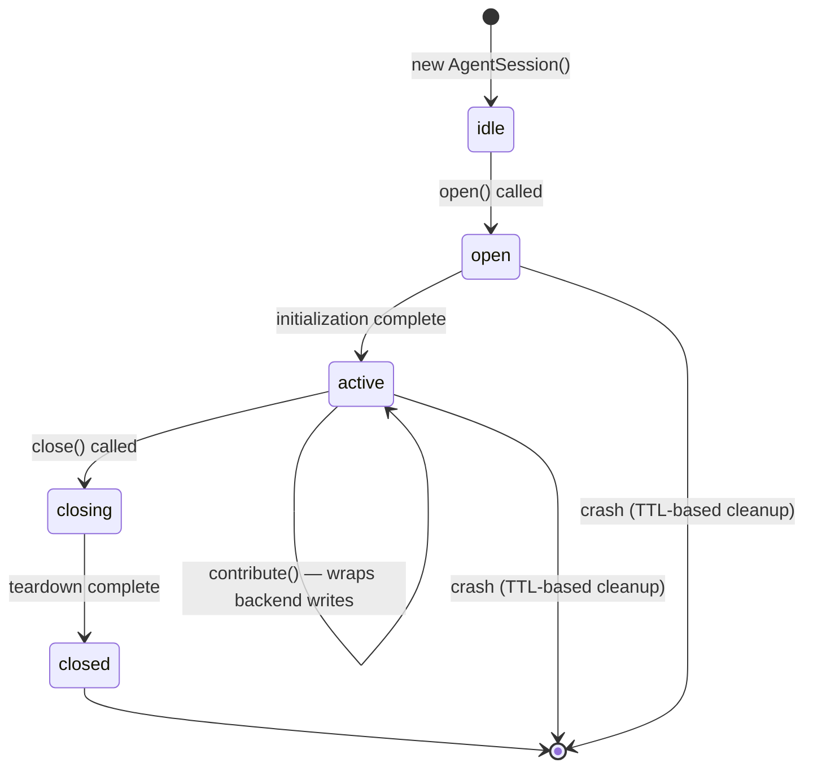

# Agent Session Lifecycle

## Why `AgentSession` Exists

Without a formal lifecycle, ephemeral agents leave orphaned state behind when they crash or abandon a session:

- **Orphaned leases** block other agents from acquiring sections until the TTL fires.
- **Stale presence entries** mislead other agents about who is currently active.
- **In-flight inbox messages** accumulate indefinitely.
- **No audit trail** — no record of what an agent contributed, when, or for how long.

`AgentSession` gives every agent — ephemeral or persistent — an explicit, auditable lifecycle. On clean close it releases leases, drains the inbox, removes presence, and emits a signed `ContributionReceipt`. On crash, existing TTLs clean up automatically within 330 seconds.

## Lifecycle State Diagram



States:

| State | Description |
|-------|-------------|
| `idle` | Session created but not started |
| `open` | `open()` in progress (health probe, presence registration) |
| `active` | Ready for `contribute()` calls |
| `closing` | `close()` in progress (lease release, inbox drain, receipt emit) |
| `closed` | Teardown complete; receipt available |

## Installation

```bash
pnpm add llmtxt
```

## Basic Usage

```typescript
import { createBackend, AgentSession } from 'llmtxt';

// 1. Create a backend (any topology — standalone, hub-spoke, or mesh)
const backend = createBackend({
  topology: 'hub-spoke',
  hubUrl: 'https://api.llmtxt.my',
  apiKey: process.env.LLMTXT_API_KEY,
});

// 2. Create a session
const session = new AgentSession({
  backend,
  agentId: 'agent-alice',
  // sessionId is auto-generated with 128-bit entropy if omitted
  label: 'Alice spec-writing session',
});

// 3. Open the session
await session.open();
// - Health probe sent to backend
// - Presence registered
// - Session start timestamp recorded

// 4. Do work via contribute()
const doc = await session.contribute(async (b) => {
  const d = await b.createDocument({
    title: 'API Spec v2',
    slug: 'api-spec-v2',
    createdBy: 'agent-alice',
  });
  await b.publishVersion(d.id, {
    content: '# API Spec\n\nVersion 2 draft.',
    publishedBy: 'agent-alice',
  });
  return d;
});

// 5. Close the session and inspect the receipt
const receipt = await session.close();
// - Final sync flush
// - Inbox drained
// - Leases released
// - Presence removed
// - ContributionReceipt emitted and persisted

console.log(JSON.stringify(receipt, null, 2));
```

## `open()`

```typescript
async open(): Promise<void>
```

Transitions state from `idle` to `open`, then to `active`. Performs:

1. **Health probe** — lightweight check that `backend` is reachable
2. **Temp storage allocation** — for `LocalBackend`: allocates a temp `.db` file at `<os.tmpdir()>/<sessionId>.db` (deleted on `close()`)
3. **Timestamp recording** — monotonic start timestamp
4. **Presence registration** — signals activity via `backend.updatePresence()`

Throws `AgentSessionError('SESSION_ALREADY_OPEN')` if called when not in `idle` state.

## `contribute()`

```typescript
async contribute<T>(fn: (backend: Backend) => Promise<T>): Promise<T>
```

Wraps a block of backend writes. Only callable when in `active` state.

- Passes the session's `backend` instance to `fn`
- Tracks `documentIds` of written documents
- Increments internal `eventCount` on each successful write
- If `fn` throws, `eventCount` and `documentIds` are not updated — partial work is not tracked

```typescript
// contribute() can be called multiple times
await session.contribute(async (b) => {
  await b.appendEvent(doc.id, { type: 'analysis.complete', payload: { score: 0.92 } });
});

await session.contribute(async (b) => {
  await b.updatePresence({ agentId: 'agent-alice', section: 'conclusion' });
});
```

## `close()`

```typescript
async close(): Promise<ContributionReceipt>
```

Tears down the session in order:

1. **Final sync flush** — `backend.flushPendingWrites()` (no-op on `RemoteBackend`)
2. **Inbox drain** — poll `backend.pollInbox()` until empty; messages discarded
3. **Lease release** — `backend.releaseLease()` for each lease acquired during the session
4. **Temp `.db` cleanup** — delete temp file if using `LocalBackend`
5. **Presence removal** — `backend.removePresence()`
6. **Receipt emission** — emit and persist `ContributionReceipt`

All teardown steps run even if earlier steps fail. Partial failures are returned as `AgentSessionError('SESSION_CLOSE_PARTIAL')` with the partial receipt attached.

Calling `close()` on an already-closed session returns the original receipt without re-running teardown (idempotent).

## ContributionReceipt

The `ContributionReceipt` is emitted at session close and provides an immutable audit record:

```typescript
interface ContributionReceipt {
  /** 128-bit random session ID (URL-safe base62). */
  sessionId: string;

  /** Agent identity. */
  agentId: string;

  /** Unique document IDs written during the session. */
  documentIds: string[];

  /** Total successful write operations via contribute(). */
  eventCount: number;

  /** Session duration in milliseconds. */
  sessionDurationMs: number;

  /** ISO 8601 UTC timestamp of session open. */
  openedAt: string;

  /** ISO 8601 UTC timestamp of session close. */
  closedAt: string;

  /**
   * Ed25519 signature (required for RemoteBackend, recommended for LocalBackend).
   * Covers: SHA-256(sessionId + agentId + documentIds.sort().join(',') +
   *          eventCount + openedAt + closedAt)
   */
  signature?: string;
}
```

### Example Receipt

```json
{
  "sessionId": "01h8xzr4k7q8m9n0p1r2",
  "agentId": "agent-alice",
  "documentIds": ["doc-abc123", "doc-def456"],
  "eventCount": 7,
  "sessionDurationMs": 4218,
  "openedAt": "2026-04-17T10:30:00.000Z",
  "closedAt": "2026-04-17T10:30:04.218Z",
  "signature": "a3f1b2c4d5e6f7a8..."
}
```

### Receipt Persistence

The receipt is persisted to:
- `backend.appendEvent()` on the first `documentId` with `type: 'session.closed'`
- `<storagePath>/session-receipts.jsonl` (LocalBackend append-only log)

### Signature Requirement

When using `RemoteBackend` (cross-network), the receipt **must** be signed with the agent's Ed25519 private key. This provides non-repudiation — any backend can verify the receipt was produced by the stated agent.

For `LocalBackend` (same-process trust boundary), signing is recommended but not required.

## Hub-and-Spoke Topology: Backend Selection

When building swarm workers, use the topology that matches your durability requirements:

| Agent type | Backend | Local `.db`? | Use when |
|------------|---------|-------------|---------|
| Persistent hub | `LocalBackend` | Yes, stable path | Owns durable state; orchestrates ephemeral workers |
| Ephemeral worker (fast) | `RemoteBackend` | No | Connects, writes via hub API, disconnects |
| Ephemeral worker (offline-capable) | `LocalBackend` (temp) | Yes, temp path | Needs offline capability; `close()` deletes the `.db` |

```typescript
// Ephemeral swarm worker — no local .db
const ephemeralBackend = createBackend({
  topology: 'hub-spoke',
  hubUrl: 'https://api.llmtxt.my',
  apiKey: process.env.LLMTXT_API_KEY,
  // persistLocally: false (default) — RemoteBackend only
});

// Persistent spoke with local replica
const persistentBackend = createBackend({
  topology: 'hub-spoke',
  hubUrl: 'https://api.llmtxt.my',
  apiKey: process.env.LLMTXT_API_KEY,
  persistLocally: true,
  storagePath: './persistent-agent',
});
```

Ephemeral workers using `RemoteBackend` have zero local cleanup — `close()` just drains the inbox and signals presence removal. No `.db` file to delete.

## Crash Recovery Contract

`AgentSession` does not require new server infrastructure. Crash recovery relies exclusively on **existing TTL mechanisms** in the backend:

| Resource | TTL mechanism | Max cleanup time |
|----------|--------------|-----------------|
| Section leases | `leases.expiresAt` (reaper sweep) | ≤ 300 s |
| Presence entries | `presenceTtlMs` in BackendConfig | 30 s |
| A2A inbox messages | `expiresAt` on InboxMessage | Policy-defined |

**Guarantee**: If a process dies without calling `close()`, all lease and presence state is cleaned up within **330 seconds** of the crash (max lease duration 300 s + presence TTL 30 s), with no manual intervention.

**Known gap**: A2A inbox messages addressed to the crashed agent accumulate until sender TTLs fire. Ephemeral workers should set short TTLs on messages they receive. This is accepted, not deferred.

## CLI Commands

```bash
# Start a session (returns sessionId to stdout)
llmtxt session start --agent-id agent-alice --label "morning spec run"
# {"sessionId":"01h8x...","agentId":"agent-alice","openedAt":"2026-04-17T10:30:00Z"}

# End the active session (emits ContributionReceipt JSON to stdout)
llmtxt session end
# {"sessionId":"01h8x...","eventCount":7,"documentIds":[...],...}
```

## Security Notes

- **Session IDs**: generated with `crypto.randomUUID()` (128-bit entropy). Predictable session IDs allow session enumeration and hijacking in multi-agent environments.
- **Receipt signing**: Ed25519 signing (same key infrastructure as identity.rs) provides non-repudiation for cross-network sessions.
- **Temp `.db` files**: created with mode `0600` — not readable by other local users.
- **`agentId` validation**: the `agentId` on the session must match the authenticated identity registered with the backend; contribution spoofing is prevented.

## Related Docs

- [Topology Guide](/docs/architecture/topology) — standalone, hub-spoke, and mesh backend selection
- [Presence and Awareness](/docs/multi-agent/presence) — how presence entries are managed
- [Leases](/docs/multi-agent/leases) — section lease acquire/release semantics
- [Blob Attachments](/docs/sdk/blob-attachments) — attaching binary files within a session
